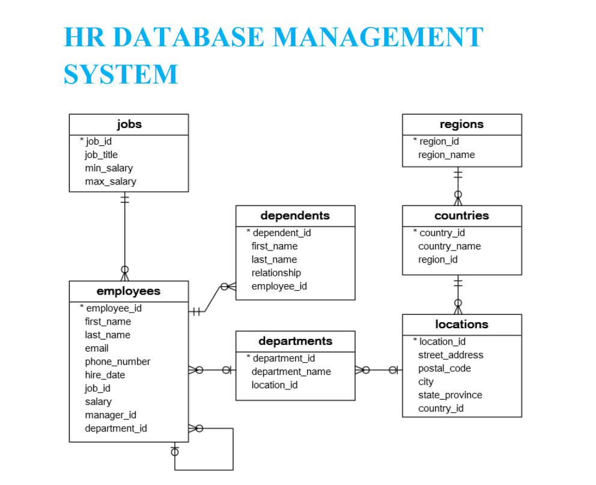

# HR Database Management System (SQL)

A complete SQL project built on the classic **HR sample database** (7 related tables). It covers schema creation, data population, and a full progression of SQL queries from basic `SELECT` statements to advanced subqueries. Completed as part of the **CoachX Live** industrial skills program.

---

## 📌 Overview

The HR database models a company's people and organizational structure across seven tables. It is used to practice real-world SQL: filtering, sorting, joins, grouping, set operations, and subqueries.

| Table | Rows | Stores |
| --- | --- | --- |
| `employees` | 40 | Employee records (name, email, salary, manager, department) |
| `dependents` | 30 | Employees' dependents |
| `departments` | 11 | Department data |
| `jobs` | 11 | Job titles and salary ranges |
| `locations` | 7 | Department locations |
| `countries` | 25 | Countries where the company operates |
| `regions` | 4 | Regions (Europe, Americas, Asia, Middle East and Africa) |

---

## 🗂️ Entity Relationships



- Each region has many countries; each country has many locations.
- Each location has many departments; each department has many employees.
- Each employee has one job and may have many dependents.
- `manager_id` is a self-referencing key (an employee reports to another employee).

---

## 📂 Repository Contents

| File | Description |
| --- | --- |
| `HR Database Management System.sql` | Full SQL script: `CREATE TABLE` statements, `INSERT` data for all 7 tables, and query solutions. |
| `HR Database Management System.pdf` | Project documentation: schema diagrams, table overview, and all task/problem statements. |

---

## 🚀 How to Run

1. Open **SQL Server Management Studio (SSMS)** (or any compatible SQL engine).
2. Create a new database and select it:
   ```sql
   CREATE DATABASE HR;
   USE HR;
   ```
3. Run the `CREATE TABLE` statements in order: `regions -> countries -> locations -> jobs -> departments -> employees -> dependents` (order matters because of foreign keys).
4. Run the `INSERT` statements to populate the tables.
5. Execute the query solutions to explore the tasks below.

---

## 🧩 Topics Covered (Tasks)

| Task | Focus | Key Concepts |
| --- | --- | --- |
| **Task 1** | Basics | `SELECT`, `ORDER BY`, `DISTINCT`, `TOP N`, `WHERE`, comparison operators, `ALTER TABLE`, foreign keys |
| **Task 2** | Logical & special operators | `AND`, `OR`, `NOT`, `BETWEEN`, `IN`, `LIKE`, `ANY`, `ALL`, `EXISTS` |
| **Task 3** | Joins | `INNER JOIN`, `LEFT JOIN`, self-join, `FULL OUTER JOIN`, `CROSS JOIN` |
| **Task 4** | Aggregation | `GROUP BY`, `HAVING`, `MIN`/`MAX`/`AVG`/`SUM`/`COUNT` |
| **Task 5** | Set & conditional | `UNION`, `INTERSECT`, `EXISTS`, `CASE`, `UPDATE` |
| **Final Task** | Advanced | Correlated and nested **subqueries** |

---

## 🔑 Key Learnings

- Designing normalized tables with primary and foreign keys.
- Enforcing referential integrity with `ON DELETE CASCADE ON UPDATE CASCADE`.
- Writing queries that progress from single-table filtering to multi-table joins and nested subqueries.
- Using aggregate functions with `GROUP BY` and `HAVING` for business reporting.

---

## 🧰 Tools & Technologies

- **SQL / Microsoft SQL Server (SSMS)**

---

## 👤 Author

**Chetan Parmar**  
Project completed under the **CoachX Live** teaching-learning platform.

---

## 📄 License

This project is available for educational and reference purposes.

